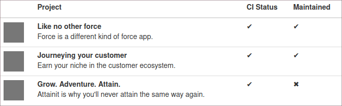

# Open Source Profile

Self-Hosted profile page for your Open Source packages & contributions.

## Vision

The general idea of this project is to have _one_ place with _all_ Open Source
packages and contributions of a person.

There are several platforms to host Open Source projects like GitHub, Gitlab,
Bitbucket, Sourceforge & Launchpad, and they all have fancy user profile pages.
They are isolated however. On BitBucket I can't showcase the one project I
maintain on GitLab only. The GitHub activity stream won't show contributions to
Launchpad. Let alone projects with self-hosted Git servers.

This creates a vendor lock-in. Which becomes obious when you search for
Open Source Software catalogues, contributions, or statistics. Most support
GitHub only.

Goals:

- List of all projects and packages of a person
- List of contributions of a person (issues, merge requests, commits)
- List of packages a person likes (starred projects)
- Highlight packages - Show most important projects at a glance
- Hide packages - Don't show the packages generated automatically by subsplits,
  forks or mirrors
- Support for multiple Git hosting services (not just GitHub)
- Link mirrors - Git supports multiple remotes,
  no need to limit to one repository host only
- Reduced UI (no platform specific buttons)

The package follows the KISS principle.

## 🚧 WIP

The package is only prototype right now, to go through the idea.

Next steps:
 
- Add a framework like Slim or Symfony and a template engine
- Add more metadata to projects and user
- Add a tool to initiate the project list
- Fetch contributions
- Fetch metadata (only overwrite fields like description)
- Make the output static (to deploy to Static Hosts)

## Requirements

- PHP

## Installation

Packagist Entry https://packagist.org/packages/pixelbrackets/open-source-profile/

- Point your webserver to the web directory
- Copy `data/projects.template.json` to `data/projects.json` and add links to
  all your repositories
- Copy `data/user.template.json` to `data/user.json` and add your username

## Source

https://gitlab.com/pixelbrackets/open-source-profile/

Mirror https://github.com/pixelbrackets/open-source-profile/

## Demo

🚀 https://opensource.pixelbrackets.de/

## Usage

The `data` directory holds all necessary information to generate the view.

## License

GNU General Public License version 2 or later

The GNU General Public License can be found at http://www.gnu.org/copyleft/gpl.html.

## Author

Dan Untenzu (<mail@pixelbrackets.de> / [@pixelbrackets](https://pixelbrackets.de))

## Changelog

See [./CHANGELOG.md](CHANGELOG.md)

## Contribution

This script is Open Source, so please use, patch, extend or fork it.

[Contributions](CONTRIBUTING.md) are welcome!
